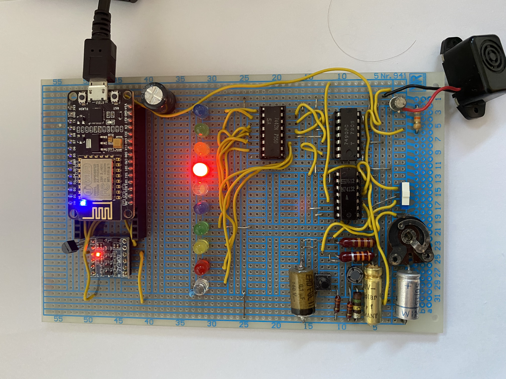

# 10'er LED Bastelprojekt
Dies ist die Kurzdokumentation zu einer länger zurückliegenden "MINT"-Aktion mit meiner jüngsten Tochter.

Es ging einfach darum einmal etwas aus elektronischen Bauteilen zusammenzubauen, was "nett anzusehen" ist und bei dem verschiedene Bauelemente erklärt und genutzt werden.

Aus meinen "wilden Elektronikjahren" hatte ich noch ein paar IC's der 74'er Serie, diverse Wiederstände, Kondensatoren, Potentiometer, Schalter und LED's gab es auch in Mengen.
## Phase 1
Die Idee war schnell geboren ein "Lauflicht" zu bauen.
Ein 7490 als Zähler, gekoppelt mit einem 7442 zur Ansteuerung der LED's.
Ein astabiler Multivibrator aus 2 Elementen eines 74132 dient als Taktgeber.

Danach kam dann die Frage: "Wie kann man das jetzt noch sinnvoll nutzen?" 
Diese Frage wurde dann mit: "Ein elektronischer Würfel" beantwortet. 

Also wurde die Schaltung noch etwas erweitert. Ein Taster für die Aktivierung des Lauflichts, ein Schalter für den "Reset" bei "7" und ein genereller "Reset" Mechanismus waren schnell hinzugebaut. 
## Phase 2
Als nächstes kam von meiner Tochter dann die Anmerkung: "Was sind das eigentlich für komische Teile mit denen Du im Moment immer rumspielst?" 
Gemeint waren die Arduinos und ESPs dieser Welt und wir haben überlegt, dass es heutzutage doch viel hipper ist diesen Würfel über das Netzwerk zu steuern.

Gesagt, getan wir haben die Schaltung dann so umdesigned, dass sie sowohl manuell als auch per ESP8266 über das Wlan gesteuert werden kann.

Da die TTL Bausteine mit 5V arbeiten, der ESP8266 jedoch nur mit 3V, haben wir einen 
PCA9306 zur Pegelwandlung genutzt. Wenn die Elektronik manuell betrieben wird, bekommt das Programm im ESP8266 hierzu eine Rückmeldung und beendet die aktuellen Aktivitäten.

## Phase 3
Was macht man sinnvollerweise mit der Schaltung, wenn gerade kein Würfel oder Lauflicht benötigt wird?

Wie ist es mit einer Temperaturanzeige? Ein DS1820 war noch in der Bastelkiste verfügbar.
Meine Tochter machte große Augen. "Es leuchtet doch immer nur eine LED, wie willst Du da 21,6°C anzeigen?"

Es geht, wenn die Trägheit des Auges wie bei einem Film überlistet wird. Das ist in der gegebenen Konstellation nicht perfekt, da sich die verschiedenfarbigen LEDS leicht unterschiedlich verhalten. Aber der Effekt ist zu sehen.
Wir haben das Programm so gestaltet, dass nacheinander die 10'er stellen von links nach rechts, die 1'er Stellen von rechts nach links und die Nachkommastellen blinkend auch von rechts nach links angezeigt werden. 
Dieses geschieht durch eine langsamere Taktung für die zu beleuchtenden LEDs und eine schnelle Taktung für die "dunklen" LEDs. 

Den [Schaltplan](Schaltbild-10erLED.pdf) haben wir mit KiCad gezeichnet.

## Phase 4
Manchmal sind bei Spielen sowohl ein Würfel als auch ein Timer notwendig, die Temperaturanzeige sollte auch manuell eingeschaltet werden können und vielleicht benötigt man auch einen Zufallszahlengenerator.

Wir haben dieses dann auch noch einprogrammiert.

* die interne LED zeigt den Timer an (später ist auf die Schnelle noch ein Piezo-Summer an D4 hinzugefügt worden), der über einen Transistor angesteuert wird.
* die "Flash-Taste" am ESP8266 aktiviert manuell die Temperaturanzeige.
* Der 1'er Stellen des Zufallszahlengenerator (0-99) werden per LED's angezeigt diese Anzeige kann natürlich auch als Zufahlszahl (1-10) interpretiert werden.

**Die minimalistische Webseite:**

##Zusammenfassung
Es ist doch immer wieder interessant zu sehen, wie sich spielerisch eine Anfangsidee weiterentwickelt.

Nach einem Redesign auf heutige Verhältnisse würde das Konstrukt beispielsweise aus einem ESP8266 und Neopixel bestehen. Oder vielleicht ein ESP32 mit Bluetooth Steuerung statt WLAN ... oder .. 

Auf jeden Fall: Meine Tochter kann jetzt löten :-).