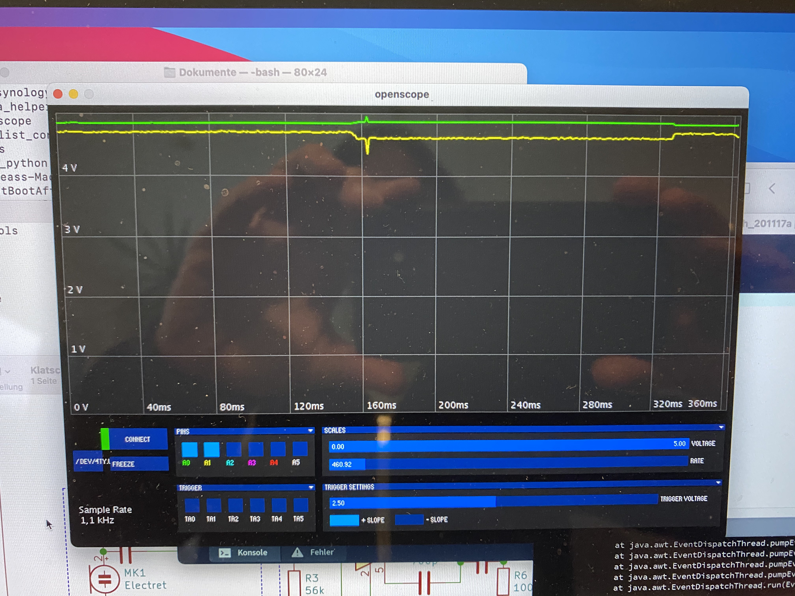
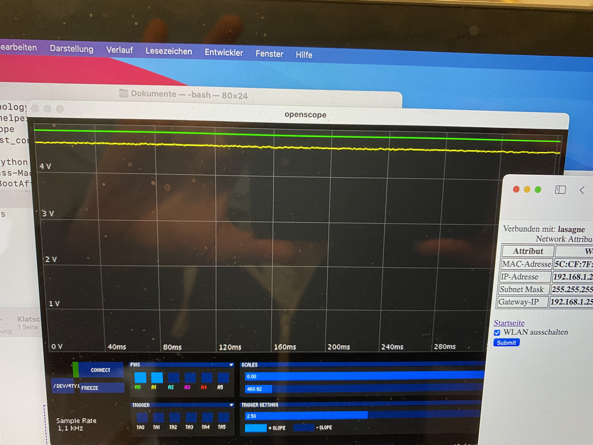

# Klingeldetektor

Das Problem: Schwerhörige hören die normale Klingel nicht UND es ist nicht möglich die üblichen Klingelverstärker in die Haus-Klingelanlage zu integrieren.

Die Lösung:
Aufbau einer "Klatsch-Schalter" Lösung, die auf das Klingelsignal trainiert wird.

Die Schaltung besteht aus mehreren Stufen:

*	Kondensatormikrofon
* 	analoge Verstärkerschaltung (OpAmp)
*  Schmitt-Trigger (OpAmp)
*  Monostabiler Multivibrator

Das finale Signal wird anschliessend von einem ESP8266 aufgenommen und analysiert.
Insbesondere werden die Signale innerhalb einer bestimmten Zeiteinheit (3-4 Sekunden) gezählt und bei einer einstellbaren Signalanzahl wird die Zusatzklingel ausgelöst.

Im ESP läuft zusätzlich noch ein WebServer zur Einstellung der Signalanzahl, Darstellung verschiedener Status- und Zusatzinformationen.

Im Rahmen des Aufbaus hat sich folgende interessante Beobachtung ergeben:

Am NodeMCU-Pin "VIN" hatte ich die Versorgungsspannung für die elektronische Schaltung angelegt. Es zeichnete sich ab, dass bei eingeschaltetem WlAN-MODUL des ESP8266 viele Fehlsignale erzeugt wurden. Eine Analyse ergab, dass die Versorgungsspannung (gelbe Linie) mit eingeschaltetem WLAN start schwankte: 

Dieses führte in der Gesamtschaltung zu einer Vielzahl von Fehlsignalen.
Sobald das WLAN-Modul abgeschaltet wird ist die Spannung (gelbe Linie) konstant:

Die Modifikation der Spannungsversorgung mit einer Diode und einem 1000uF Elko auf der Vin-Seite brachte den gewünschten Erfolg der Reduktion der Störsignale. Die [Gesamtschaltung](./Klatschschalter-Klingeldetektor.pdf) wurde noch ergänzt durch den Ersatz der Batterie des Klingelsenders durch eine direkte 3,3V Spannungsversorgung.

Bei Verlust der Versorgungsspannung stellt der Sender der Klingel leider den 1. Gong (von 8 möglichen) ein. Dieses lässt sich über die Webseite im ESP8266 modifizieren.

